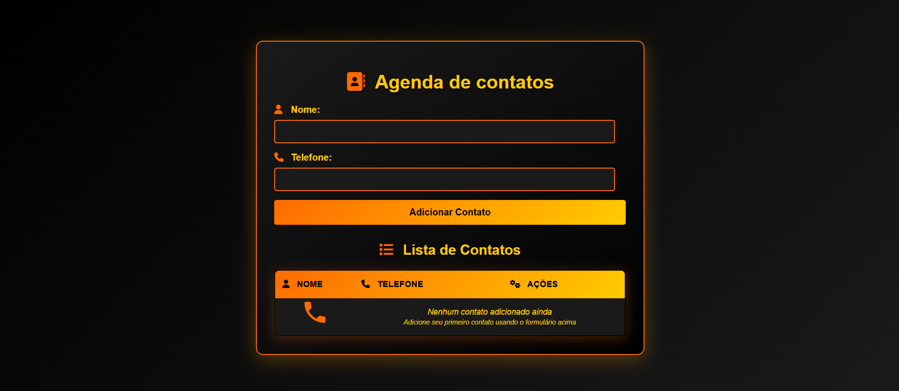

# Agenda de Contatos - EBAC

Uma aplicação web moderna e responsiva para gerenciamento de contatos pessoais, desenvolvida como projeto da **EBAC (Escola Britânica de Artes Criativas e Tecnologia)**.

## Link da Aplicação

**Acesse a aplicação:** https://larissaruiz-agenda-contatos.vercel.app/

## Prévia da Aplicação



## Requisitos da Atividade

Este projeto atende completamente aos requisitos solicitados pela EBAC:

### 1. Tabela com duas colunas
- **Nome**: Coluna para exibir o nome do contato
- **Telefone**: Coluna para exibir o número de telefone
- **Ações**: Coluna adicional para funcionalidades extras (remover contato)

### 2. Formulário de cadastro
- Campo de **nome** (obrigatório)
- Campo de **telefone** (obrigatório)
- Botão **"Adicionar Contato"** que insere nova linha na tabela
- Validação de campos obrigatórios
- Prevenção de contatos duplicados

### 3. Publicação na Vercel
- Repositório no GitHub: [Agenda_contatos](https://github.com/Lalisruiz/Agenda_contatos.git)
- Deploy automático na Vercel
- **Link do projeto**: https://larissaruiz-agenda-contatos.vercel.app/

### 4. Funcionalidades extras implementadas
- Design responsivo e moderno
- Formatação automática de telefone brasileiro
- Animações e efeitos visuais
- Ícones profissionais Font Awesome
- Funcionalidade de remoção de contatos

## Design

A aplicação apresenta um design moderno com esquema de cores **preto, laranja e amarelo**, proporcionando uma experiência visual atraente e profissional.


## Funcionalidades

- **Adicionar contatos** com nome e telefone
- **Visualizar lista** de contatos em tabela estilizada
- **Remover contatos** com confirmação
- **Validação de duplicatas** - impede contatos repetidos
- **Formatação automática** de números de telefone brasileiros
- **Design responsivo** para dispositivos móveis
- **Animações suaves** e efeitos visuais
- **Ícones profissionais** Font Awesome
- **Estado vazio** com feedback visual

## Tecnologias Utilizadas

- **HTML5** - Estrutura semântica
- **CSS3** - Estilização moderna com gradientes e animações
- **JavaScript (ES6+)** - Lógica da aplicação e manipulação do DOM
- **Font Awesome** - Ícones profissionais

## Recursos Técnicos

### CSS Avançado
- Gradientes lineares personalizados
- Animações CSS3 (`@keyframes`)
- Efeitos de hover e transições
- Design responsivo com media queries
- Box-shadow e border-radius para visual moderno

### JavaScript
- Manipulação dinâmica do DOM
- Validação de formulários
- Formatação de dados (telefone)
- Gerenciamento de eventos
- Animações programáticas

## Como Usar

### Acesso Online (Vercel)
Acesse a aplicação diretamente pelo link: **https://larissaruiz-agenda-contatos.vercel.app/**

### Execução Local

1. **Clone o repositório**
   ```bash
   git clone https://github.com/Lalisruiz/Agenda_contatos.git
   ```

2. **Navegue até o diretório**
   ```bash
   cd Agenda_contatos
   ```

3. **Abra o arquivo HTML**
   - Duplo clique em `index.html`, ou
   - Use um servidor local:
   ```bash
   python -m http.server 8000
   ```
   Acesse: `http://localhost:8000`

## Deploy na Vercel

Para publicar este projeto na Vercel:

1. **Conecte seu repositório GitHub à Vercel**
2. **Import o projeto** na dashboard da Vercel
3. **Configure as settings** (não necessário para projetos estáticos)
4. **Deploy automático** a cada push na branch main


## Preview das Funcionalidades

### Adicionar Contato
- Preencha o nome e telefone
- Clique em "Adicionar Contato"
- O contato aparecerá na lista com animação

### Formatação Automática
- Telefones são formatados automaticamente
- Suporte para formatos: `(11) 99999-9999` e `(11) 9999-9999`

### Validação
- Campos obrigatórios
- Verificação de duplicatas
- Feedback visual para o usuário

## Responsividade

A aplicação se adapta automaticamente a diferentes tamanhos de tela:
- **Desktop**: Layout completo com animações
- **Tablet**: Layout otimizado
- **Mobile**: Interface compacta e touch-friendly

## Esquema de Cores

- **Primária**: Preto (#000000, #1a1a1a)
- **Secundária**: Laranja (#ff6b00)
- **Destaque**: Amarelo (#ffcc00)
- **Gradientes**: Combinações harmoniosas das cores principais

## Estrutura do Projeto

```
agenda_contatos/
├── index.html          # Estrutura principal da aplicação
├── style.css           # Estilos CSS com design moderno
├── main.js             # Lógica JavaScript da aplicação
├── vercel.json         # Configuração para deploy na Vercel
└── README.md           # Documentação completa do projeto
```

## Sobre a EBAC

Este projeto foi desenvolvido como parte do curso de **Desenvolvimento Front-End** da EBAC (Escola Britânica de Artes Criativas e Tecnologia), demonstrando conhecimentos em:

- **HTML5 Semântico**: Estruturação adequada de formulários e tabelas
- **CSS3 Avançado**: Responsividade, animações e design moderno
- **JavaScript ES6+**: Manipulação do DOM e validações
- **Git/GitHub**: Controle de versão e colaboração
- **Deploy/Hosting**: Publicação na Vercel

### Objetivos de Aprendizado Atingidos
- Criação de interfaces responsivas
- Manipulação dinâmica de elementos HTML
- Validação de formulários
- Organização de código limpo e documentado
- Publicação e deploy de aplicações web

## Contribuição

Contribuições são bem-vindas! Sinta-se à vontade para:

1. Fazer fork do projeto
2. Criar uma branch para sua feature (`git checkout -b feature/AmazingFeature`)
3. Commit suas mudanças (`git commit -m 'feat: Add some AmazingFeature'`)
4. Push para a branch (`git push origin feature/AmazingFeature`)
5. Abrir um Pull Request

## Desenvolvedor

Desenvolvido por [Lalisruiz](https://github.com/Lalisruiz)

---

Se este projeto foi útil para você, considere dar uma estrela no repositório!
